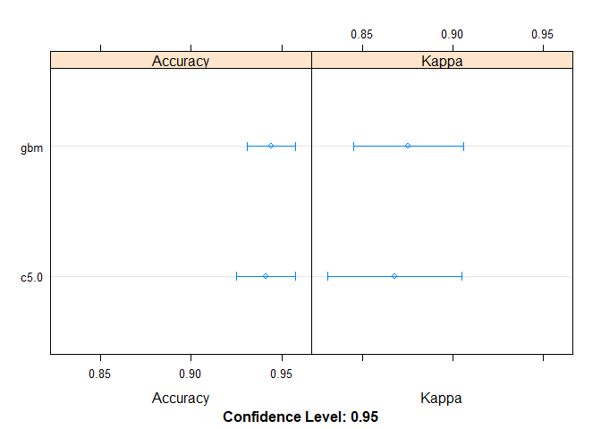
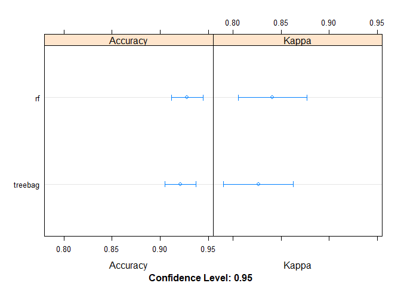
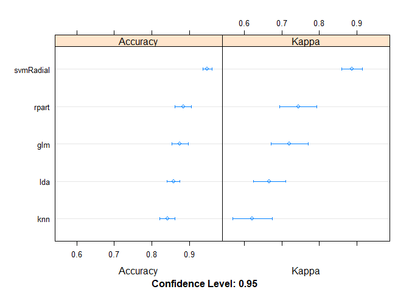
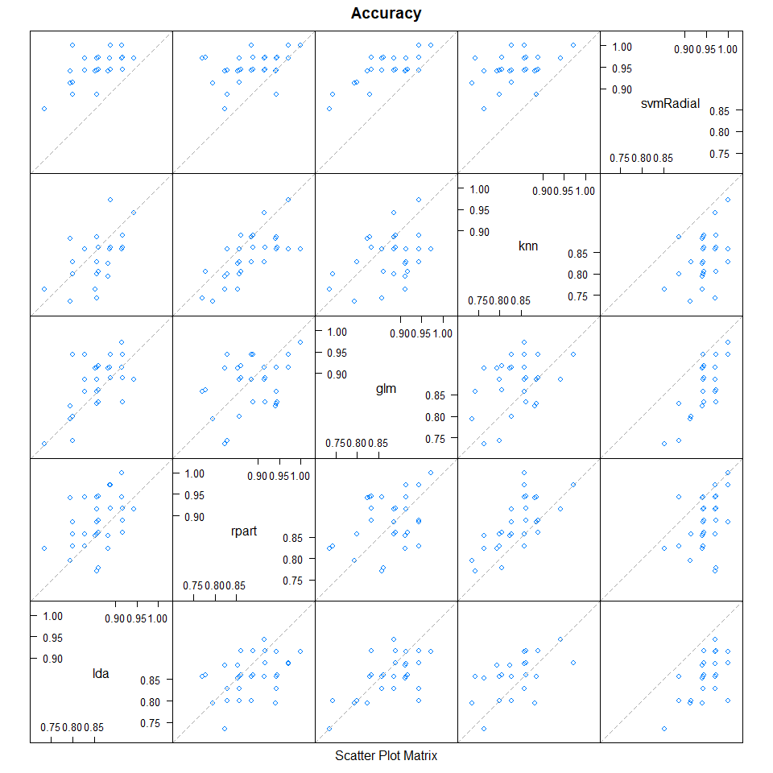
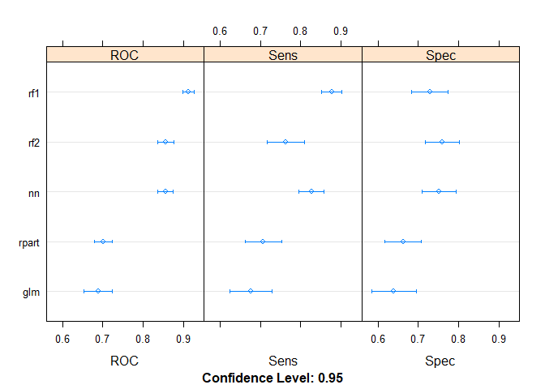
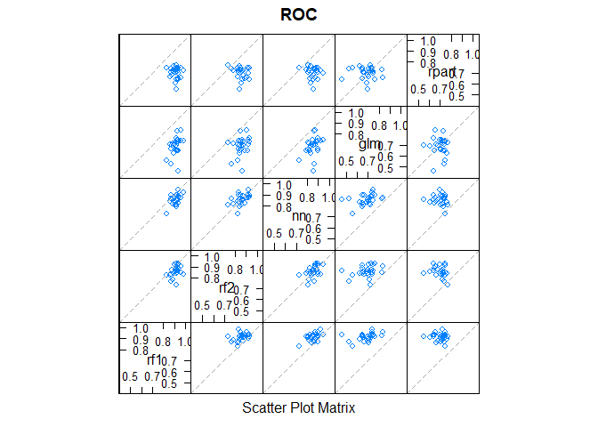

Caret Ensemble
================
Nikhil Gupta
2020-04-26 12:58:46

  - [Link](#link)
  - [Boosting](#boosting)
      - [C5.0](#c5.0)
      - [Stochastic Gradient Boosting](#stochastic-gradient-boosting)
      - [summarize results](#summarize-results)
  - [Bagging](#bagging)
      - [Bagged CART](#bagged-cart)
      - [Random Forest](#random-forest)
      - [Summarize results](#summarize-results-1)
  - [Stacking](#stacking)
      - [Create submodels](#create-submodels)
      - [Stack (caretStack - glm)](#stack-caretstack---glm)
      - [Stack (caretEnsemble - lm)](#stack-caretensemble---lm)
      - [Stack (caretStack - Random
        Forest)](#stack-caretstack---random-forest)
      - [Predictions with Stacked
        Model](#predictions-with-stacked-model)
  - [From the horse’s mouth](#from-the-horses-mouth)
      - [Setup](#setup)
      - [Customizing Model List](#customizing-model-list)
      - [Caret Ensemble (Custom Models)](#caret-ensemble-custom-models)
      - [Stacking (CaretEnsemble) - Greedy
        Algorithm](#stacking-caretensemble---greedy-algorithm)
          - [Test Metrics](#test-metrics)
          - [Extracting Variable importance in
            ensemble](#extracting-variable-importance-in-ensemble)
      - [Stacking (CaretStack)](#stacking-caretstack)
          - [Using simple glm](#using-simple-glm)
          - [Using gbm](#using-gbm)

``` r
rm(list = ls()) # Remove existing variables
```

# Link

<https://machinelearningmastery.com/machine-learning-ensembles-with-r/>

``` r
# Load libraries
library(mlbench)
library(caret)
```

    ## Loading required package: lattice

    ## Loading required package: ggplot2

``` r
library(caretEnsemble)
```

    ## 
    ## Attaching package: 'caretEnsemble'

    ## The following object is masked from 'package:ggplot2':
    ## 
    ##     autoplot

``` r
library(dplyr)
```

    ## 
    ## Attaching package: 'dplyr'

    ## The following objects are masked from 'package:stats':
    ## 
    ##     filter, lag

    ## The following objects are masked from 'package:base':
    ## 
    ##     intersect, setdiff, setequal, union

``` r
# Load the dataset
data(Ionosphere)
dataset <- Ionosphere

# Note that the first attribute was a factor (0,1) and has been transformed to be numeric for consistency with all of the other numeric attributes.
# Also note that the second attribute is a constant and has been removed.
dataset <- dataset[,-2]
dataset$V1 <- as.numeric(as.character(dataset$V1))
```

# Boosting

``` r
# Example of Boosting Algorithms
control <- trainControl(method="repeatedcv", number=10, repeats=3)
seed <- 7
metric <- "Accuracy"
```

## C5.0

``` r
set.seed(seed)
fit.c50 <- train(Class~., data=dataset, method="C5.0", metric=metric, trControl=control)
```

    ## Warning: 'trials' should be <= 1 for this object. Predictions generated using 1
    ## trials

    ## Warning: 'trials' should be <= 7 for this object. Predictions generated using 7
    ## trials

    ## Warning: 'trials' should be <= 9 for this object. Predictions generated using 9
    ## trials

    ## Warning: 'trials' should be <= 5 for this object. Predictions generated using 5
    ## trials
    
    ## Warning: 'trials' should be <= 5 for this object. Predictions generated using 5
    ## trials

## Stochastic Gradient Boosting

``` r
set.seed(seed)
fit.gbm <- train(Class~., data=dataset, method="gbm", metric=metric, trControl=control, verbose=FALSE)
```

## summarize results

``` r
boosting_results <- caret::resamples(list(c5.0=fit.c50, gbm=fit.gbm))
summary(boosting_results)
```

    ## 
    ## Call:
    ## summary.resamples(object = boosting_results)
    ## 
    ## Models: c5.0, gbm 
    ## Number of resamples: 30 
    ## 
    ## Accuracy 
    ##           Min.   1st Qu.    Median      Mean   3rd Qu. Max. NA's
    ## c5.0 0.8611111 0.9142857 0.9428571 0.9413087 0.9714286    1    0
    ## gbm  0.8571429 0.9148810 0.9436508 0.9440881 0.9714286    1    0
    ## 
    ## Kappa 
    ##           Min.   1st Qu.    Median      Mean   3rd Qu. Max. NA's
    ## c5.0 0.6830986 0.8079694 0.8734173 0.8678835 0.9372010    1    0
    ## gbm  0.6788991 0.8142060 0.8776224 0.8753566 0.9375755    1    0

``` r
lattice::dotplot(boosting_results)
```

<!-- -->

# Bagging

``` r
# Example of Bagging algorithms
control <- trainControl(method="repeatedcv", number=10, repeats=3)
seed <- 7
metric <- "Accuracy"
```

## Bagged CART

``` r
set.seed(seed)
fit.treebag <- train(Class~., data=dataset, method="treebag", metric=metric, trControl=control)
```

## Random Forest

``` r
set.seed(seed)
fit.rf <- train(Class~., data=dataset, method="rf", metric=metric, trControl=control)
```

## Summarize results

``` r
bagging_results <- resamples(list(treebag=fit.treebag, rf=fit.rf))
summary(bagging_results)
```

    ## 
    ## Call:
    ## summary.resamples(object = bagging_results)
    ## 
    ## Models: treebag, rf 
    ## Number of resamples: 30 
    ## 
    ## Accuracy 
    ##              Min.   1st Qu.    Median      Mean   3rd Qu.      Max. NA's
    ## treebag 0.8000000 0.8857143 0.9166667 0.9211407 0.9640523 0.9722222    0
    ## rf      0.8333333 0.8946078 0.9420168 0.9280781 0.9712185 1.0000000    0
    ## 
    ## Kappa 
    ##              Min.   1st Qu.    Median      Mean   3rd Qu.      Max. NA's
    ## treebag 0.5648313 0.7552448 0.8208228 0.8265147 0.9216460 0.9407895    0
    ## rf      0.6504854 0.7801430 0.8722003 0.8412055 0.9350695 1.0000000    0

``` r
dotplot(bagging_results)
```

<!-- -->

# Stacking

## Create submodels

``` r
# Example of Stacking algorithms

control <- trainControl(method="repeatedcv", number=10, repeats=3, savePredictions=TRUE, classProbs=TRUE)
algorithmList <- c('lda', 'rpart', 'glm', 'knn', 'svmRadial')
set.seed(seed)
models <- caretEnsemble::caretList(Class~., data=dataset, trControl=control, methodList=algorithmList)
```

    ## Warning in trControlCheck(x = trControl, y = target): x$savePredictions == TRUE
    ## is depreciated. Setting to 'final' instead.

    ## Warning in trControlCheck(x = trControl, y = target): indexes not defined in
    ## trControl. Attempting to set them ourselves, so each model in the ensemble will
    ## have the same resampling indexes.

    ## Warning: glm.fit: fitted probabilities numerically 0 or 1 occurred
    
    ## Warning: glm.fit: fitted probabilities numerically 0 or 1 occurred
    
    ## Warning: glm.fit: fitted probabilities numerically 0 or 1 occurred
    
    ## Warning: glm.fit: fitted probabilities numerically 0 or 1 occurred
    
    ## Warning: glm.fit: fitted probabilities numerically 0 or 1 occurred
    
    ## Warning: glm.fit: fitted probabilities numerically 0 or 1 occurred
    
    ## Warning: glm.fit: fitted probabilities numerically 0 or 1 occurred
    
    ## Warning: glm.fit: fitted probabilities numerically 0 or 1 occurred
    
    ## Warning: glm.fit: fitted probabilities numerically 0 or 1 occurred
    
    ## Warning: glm.fit: fitted probabilities numerically 0 or 1 occurred
    
    ## Warning: glm.fit: fitted probabilities numerically 0 or 1 occurred
    
    ## Warning: glm.fit: fitted probabilities numerically 0 or 1 occurred
    
    ## Warning: glm.fit: fitted probabilities numerically 0 or 1 occurred
    
    ## Warning: glm.fit: fitted probabilities numerically 0 or 1 occurred
    
    ## Warning: glm.fit: fitted probabilities numerically 0 or 1 occurred
    
    ## Warning: glm.fit: fitted probabilities numerically 0 or 1 occurred
    
    ## Warning: glm.fit: fitted probabilities numerically 0 or 1 occurred
    
    ## Warning: glm.fit: fitted probabilities numerically 0 or 1 occurred
    
    ## Warning: glm.fit: fitted probabilities numerically 0 or 1 occurred
    
    ## Warning: glm.fit: fitted probabilities numerically 0 or 1 occurred
    
    ## Warning: glm.fit: fitted probabilities numerically 0 or 1 occurred
    
    ## Warning: glm.fit: fitted probabilities numerically 0 or 1 occurred
    
    ## Warning: glm.fit: fitted probabilities numerically 0 or 1 occurred
    
    ## Warning: glm.fit: fitted probabilities numerically 0 or 1 occurred
    
    ## Warning: glm.fit: fitted probabilities numerically 0 or 1 occurred
    
    ## Warning: glm.fit: fitted probabilities numerically 0 or 1 occurred
    
    ## Warning: glm.fit: fitted probabilities numerically 0 or 1 occurred
    
    ## Warning: glm.fit: fitted probabilities numerically 0 or 1 occurred
    
    ## Warning: glm.fit: fitted probabilities numerically 0 or 1 occurred
    
    ## Warning: glm.fit: fitted probabilities numerically 0 or 1 occurred
    
    ## Warning: glm.fit: fitted probabilities numerically 0 or 1 occurred

``` r
results <- resamples(models)
summary(results)
```

    ## 
    ## Call:
    ## summary.resamples(object = results)
    ## 
    ## Models: lda, rpart, glm, knn, svmRadial 
    ## Number of resamples: 30 
    ## 
    ## Accuracy 
    ##                Min.   1st Qu.    Median      Mean   3rd Qu.      Max. NA's
    ## lda       0.7352941 0.8285714 0.8591270 0.8580657 0.8880952 0.9428571    0
    ## rpart     0.7714286 0.8529412 0.8857143 0.8838671 0.9350490 1.0000000    0
    ## glm       0.7352941 0.8333333 0.8857143 0.8753750 0.9142857 0.9714286    0
    ## knn       0.7352941 0.8055556 0.8571429 0.8418659 0.8611111 0.9722222    0
    ## svmRadial 0.8529412 0.9411765 0.9444444 0.9484407 0.9714286 1.0000000    0
    ## 
    ## Kappa 
    ##                Min.   1st Qu.    Median      Mean   3rd Qu.      Max. NA's
    ## lda       0.3598326 0.6011806 0.6715328 0.6666689 0.7419355 0.8679245    0
    ## rpart     0.4838710 0.6479222 0.7490787 0.7436022 0.8551984 1.0000000    0
    ## glm       0.3855422 0.6279400 0.7508651 0.7206173 0.8134991 0.9378330    0
    ## knn       0.3368421 0.5258215 0.6653724 0.6214965 0.6830986 0.9387755    0
    ## svmRadial 0.6586345 0.8665874 0.8788237 0.8870910 0.9385399 1.0000000    0

``` r
dotplot(results)
```

<!-- -->

``` r
# Predictions on base models
p <- as.data.frame(predict(models, newdata=head(dataset)))
print(p)
```

    ##           lda      rpart        glm knn   svmRadial
    ## 1 0.022558927 0.06306306 0.03549523 0.0 0.003503970
    ## 2 0.733010565 0.06306306 0.87890467 0.2 0.983267424
    ## 3 0.008891553 0.06306306 0.02256042 0.0 0.001851438
    ## 4 0.710018159 0.06306306 0.88539614 0.4 0.983253320
    ## 5 0.029718844 0.06306306 0.11431746 0.0 0.021057823
    ## 6 0.938018170 0.94805195 0.97410266 1.0 0.992200592

When we combine the predictions of different models using stacking, it
is desirable that the predictions made by the sub-models have low
correlation. This would suggest that the models are skillful but in
different ways, allowing a new classifier to figure out how to get the
best from each model for an improved score.

If the predictions for the sub-models were highly corrected (\>0.75)
then they would be making the same or very similar predictions most of
the time reducing the benefit of combining the predictions.

``` r
# correlation between results
caret::modelCor(results)
```

    ##                 lda     rpart       glm       knn svmRadial
    ## lda       1.0000000 0.4001494 0.6029387 0.5112169 0.6008459
    ## rpart     0.4001494 1.0000000 0.3307816 0.7040301 0.3739250
    ## glm       0.6029387 0.3307816 1.0000000 0.3472425 0.7387988
    ## knn       0.5112169 0.7040301 0.3472425 1.0000000 0.4067582
    ## svmRadial 0.6008459 0.3739250 0.7387988 0.4067582 1.0000000

``` r
lattice::splom(results)
```

<!-- -->

## Stack (caretStack - glm)

``` r
stackControl <- trainControl(method="repeatedcv", number=10, repeats=3, savePredictions=TRUE, classProbs=TRUE)
set.seed(seed)
stack.glm <- caretEnsemble::caretStack(models, method="glm", metric="Accuracy", trControl=stackControl)
print(stack.glm)
```

    ## A glm ensemble of 5 base models: lda, rpart, glm, knn, svmRadial
    ## 
    ## Ensemble results:
    ## Generalized Linear Model 
    ## 
    ## 1053 samples
    ##    5 predictor
    ##    2 classes: 'bad', 'good' 
    ## 
    ## No pre-processing
    ## Resampling: Cross-Validated (10 fold, repeated 3 times) 
    ## Summary of sample sizes: 947, 947, 948, 948, 947, 948, ... 
    ## Resampling results:
    ## 
    ##   Accuracy   Kappa    
    ##   0.9509604  0.8935122

## Stack (caretEnsemble - lm)

``` r
stackControl <- trainControl(method="repeatedcv", number=10, repeats=3, savePredictions=TRUE, classProbs=TRUE)
greedy_ensemble <- caretEnsemble(models, metric="Accuracy", trControl=stackControl)
summary(greedy_ensemble)
```

    ## The following models were ensembled: lda, rpart, glm, knn, svmRadial 
    ## They were weighted: 
    ## 4.3216 -1.5231 -0.5695 -0.4919 0.9845 -6.9992
    ## The resulting Accuracy is: 0.9494
    ## The fit for each individual model on the Accuracy is: 
    ##     method  Accuracy AccuracySD
    ##        lda 0.8580657 0.04686787
    ##      rpart 0.8838671 0.05897202
    ##        glm 0.8753750 0.05854703
    ##        knn 0.8418659 0.05328423
    ##  svmRadial 0.9484407 0.03363672

We can also use more sophisticated algorithms to combine predictions in
an effort to tease out when best to use the different methods. In this
case, we can use the random forest algorithm to combine the predictions.

## Stack (caretStack - Random Forest)

``` r
set.seed(seed)
stack.rf <- caretEnsemble::caretStack(models, method="rf", metric="Accuracy", trControl=stackControl)
print(stack.rf)
```

    ## A rf ensemble of 5 base models: lda, rpart, glm, knn, svmRadial
    ## 
    ## Ensemble results:
    ## Random Forest 
    ## 
    ## 1053 samples
    ##    5 predictor
    ##    2 classes: 'bad', 'good' 
    ## 
    ## No pre-processing
    ## Resampling: Cross-Validated (10 fold, repeated 3 times) 
    ## Summary of sample sizes: 947, 947, 948, 948, 947, 948, ... 
    ## Resampling results across tuning parameters:
    ## 
    ##   mtry  Accuracy   Kappa    
    ##   2     0.9667798  0.9277270
    ##   3     0.9655129  0.9250793
    ##   5     0.9645546  0.9233199
    ## 
    ## Accuracy was used to select the optimal model using the largest value.
    ## The final value used for the model was mtry = 2.

## Predictions with Stacked Model

``` r
predictions = predict(stack.rf, newdata = dataset %>% dplyr::select(-Class))
train_accuracy = sum(predictions == dataset$Class)/nrow(dataset)
train_accuracy
```

    ## [1] 0.988604

# From the horse’s mouth

  - <https://cran.r-project.org/web/packages/caretEnsemble/vignettes/caretEnsemble-intro.html>

## Setup

``` r
#Adapted from the caret vignette
library("caret")
library("mlbench")
library("pROC")
```

    ## Type 'citation("pROC")' for a citation.

    ## 
    ## Attaching package: 'pROC'

    ## The following objects are masked from 'package:stats':
    ## 
    ##     cov, smooth, var

``` r
data(Sonar)
set.seed(107)
inTrain <- createDataPartition(y = Sonar$Class, p = .75, list = FALSE)
training <- Sonar[ inTrain,]
testing <- Sonar[-inTrain,]
my_control <- trainControl(
  method="boot",
  number=25,
  savePredictions="final",
  classProbs=TRUE,
  index=createResample(training$Class, 25),
  summaryFunction=twoClassSummary
  )
```

Notice that we are explicitly setting the resampling index to being used
in trainControl. If you do not set this index manually, caretList will
attempt to set it for automatically, **but it"s generally a good idea to
set it yourself.**

## Customizing Model List

``` r
library("mlbench")
library("randomForest")
```

    ## randomForest 4.6-14

    ## Type rfNews() to see new features/changes/bug fixes.

    ## 
    ## Attaching package: 'randomForest'

    ## The following object is masked from 'package:dplyr':
    ## 
    ##     combine

    ## The following object is masked from 'package:ggplot2':
    ## 
    ##     margin

``` r
library("nnet")

# This will create 5 models - glm and rpart with defaults, and rf1, rf2, nn with the customized parameters
model_list_big <- caretList(
  Class~., data=training,
  trControl=my_control,
  metric="ROC",
  methodList=c("glm", "rpart"),
  tuneList=list(
    rf1=caretModelSpec(method="rf", tuneGrid=data.frame(.mtry=c(2,20))),
    rf2=caretModelSpec(method="rf", tuneGrid=data.frame(.mtry=10), preProcess="pca"),
    nn=caretModelSpec(method="nnet", tuneLength=2, trace=FALSE)
  )
)
```

    ## Warning: glm.fit: algorithm did not converge

    ## Warning: glm.fit: fitted probabilities numerically 0 or 1 occurred

    ## Warning: glm.fit: algorithm did not converge

    ## Warning: glm.fit: fitted probabilities numerically 0 or 1 occurred

    ## Warning: glm.fit: algorithm did not converge

    ## Warning: glm.fit: fitted probabilities numerically 0 or 1 occurred

    ## Warning: glm.fit: algorithm did not converge

    ## Warning: glm.fit: fitted probabilities numerically 0 or 1 occurred

    ## Warning: glm.fit: algorithm did not converge

    ## Warning: glm.fit: fitted probabilities numerically 0 or 1 occurred

    ## Warning: glm.fit: algorithm did not converge

    ## Warning: glm.fit: fitted probabilities numerically 0 or 1 occurred

    ## Warning: glm.fit: algorithm did not converge

    ## Warning: glm.fit: fitted probabilities numerically 0 or 1 occurred

    ## Warning: glm.fit: algorithm did not converge

    ## Warning: glm.fit: fitted probabilities numerically 0 or 1 occurred

    ## Warning: glm.fit: algorithm did not converge

    ## Warning: glm.fit: fitted probabilities numerically 0 or 1 occurred

    ## Warning: glm.fit: algorithm did not converge

    ## Warning: glm.fit: fitted probabilities numerically 0 or 1 occurred

    ## Warning: glm.fit: algorithm did not converge

    ## Warning: glm.fit: fitted probabilities numerically 0 or 1 occurred

    ## Warning: glm.fit: algorithm did not converge

    ## Warning: glm.fit: fitted probabilities numerically 0 or 1 occurred

    ## Warning: glm.fit: algorithm did not converge

    ## Warning: glm.fit: fitted probabilities numerically 0 or 1 occurred

    ## Warning: glm.fit: algorithm did not converge

    ## Warning: glm.fit: fitted probabilities numerically 0 or 1 occurred

    ## Warning: glm.fit: algorithm did not converge

    ## Warning: glm.fit: fitted probabilities numerically 0 or 1 occurred

    ## Warning: glm.fit: algorithm did not converge

    ## Warning: glm.fit: fitted probabilities numerically 0 or 1 occurred

    ## Warning: glm.fit: algorithm did not converge

    ## Warning: glm.fit: fitted probabilities numerically 0 or 1 occurred

    ## Warning: glm.fit: algorithm did not converge

    ## Warning: glm.fit: fitted probabilities numerically 0 or 1 occurred

    ## Warning: glm.fit: algorithm did not converge

    ## Warning: glm.fit: fitted probabilities numerically 0 or 1 occurred

    ## Warning: glm.fit: algorithm did not converge

    ## Warning: glm.fit: fitted probabilities numerically 0 or 1 occurred

    ## Warning: glm.fit: algorithm did not converge

    ## Warning: glm.fit: fitted probabilities numerically 0 or 1 occurred

    ## Warning: glm.fit: algorithm did not converge

    ## Warning: glm.fit: fitted probabilities numerically 0 or 1 occurred

    ## Warning: glm.fit: algorithm did not converge

    ## Warning: glm.fit: fitted probabilities numerically 0 or 1 occurred

    ## Warning: glm.fit: algorithm did not converge

    ## Warning: glm.fit: fitted probabilities numerically 0 or 1 occurred

    ## Warning: glm.fit: algorithm did not converge

    ## Warning: glm.fit: fitted probabilities numerically 0 or 1 occurred

    ## Warning: glm.fit: algorithm did not converge

    ## Warning: glm.fit: fitted probabilities numerically 0 or 1 occurred

``` r
p <- as.data.frame(predict(model_list_big, newdata=head(testing)))
print(p)
```

    ##     rf1   rf2        nn          glm     rpart
    ## 1 0.436 0.386 0.3038952 2.220446e-16 0.8750000
    ## 2 0.656 0.536 0.9774245 1.000000e+00 0.8750000
    ## 3 0.526 0.516 0.9678167 1.000000e+00 0.1818182
    ## 4 0.458 0.468 0.3206499 2.354789e-05 0.1818182
    ## 5 0.198 0.180 0.1608271 2.220446e-16 0.1818182
    ## 6 0.496 0.522 0.7511809 1.000000e+00 0.1818182

## Caret Ensemble (Custom Models)

Finally, you should note that caretList does not support custom caret
models. Fitting those models are beyond the scope of this vignette, but
if you do so, you can manually add them to the model list
(e.g. model\_list\_big\[\[“my\_custom\_model”\]\] \<-
my\_custom\_model). **Just be sure to use the same re-sampling indexes
in trControl as you use in the caretList models\!**

## Stacking (CaretEnsemble) - Greedy Algorithm

``` r
results <- resamples(model_list_big)
summary(results)
```

    ## 
    ## Call:
    ## summary.resamples(object = results)
    ## 
    ## Models: rf1, rf2, nn, glm, rpart 
    ## Number of resamples: 25 
    ## 
    ## ROC 
    ##            Min.   1st Qu.    Median      Mean   3rd Qu.      Max. NA's
    ## rf1   0.8324353 0.8918367 0.9183908 0.9136459 0.9316092 0.9847021    0
    ## rf2   0.7328629 0.8335459 0.8563412 0.8559600 0.8909091 0.9298738    0
    ## nn    0.7306034 0.8340136 0.8586207 0.8559390 0.8915344 0.9428904    0
    ## glm   0.4614943 0.6515152 0.7070707 0.6884429 0.7351852 0.8339844    0
    ## rpart 0.5528736 0.6649832 0.7189153 0.7013261 0.7386243 0.7706653    0
    ## 
    ## Sens 
    ##            Min.   1st Qu.    Median      Mean   3rd Qu.      Max. NA's
    ## rf1   0.7428571 0.8518519 0.8928571 0.8767571 0.9117647 0.9687500    0
    ## rf2   0.4375000 0.7096774 0.7857143 0.7627882 0.8125000 0.9565217    0
    ## nn    0.6571429 0.7878788 0.8285714 0.8268379 0.8750000 0.9393939    0
    ## glm   0.4516129 0.6000000 0.6666667 0.6760522 0.7777778 0.9375000    0
    ## rpart 0.3928571 0.6250000 0.7428571 0.7068598 0.7857143 0.8888889    0
    ## 
    ## Spec 
    ##            Min.   1st Qu.    Median      Mean   3rd Qu.      Max. NA's
    ## rf1   0.4848485 0.6428571 0.7307692 0.7285292 0.7916667 0.9565217    0
    ## rf2   0.5172414 0.6969697 0.7407407 0.7598520 0.8571429 0.9259259    0
    ## nn    0.4482759 0.7096774 0.7500000 0.7521860 0.8148148 0.9259259    0
    ## glm   0.2758621 0.6071429 0.6296296 0.6393789 0.7500000 0.8333333    0
    ## rpart 0.4000000 0.5925926 0.6785714 0.6621604 0.7407407 0.9130435    0

``` r
dotplot(results)
```

<!-- -->

``` r
caret::modelCor(results)
```

    ##               rf1        rf2          nn         glm       rpart
    ## rf1    1.00000000  0.3644033  0.53526856  0.43830998 -0.07016635
    ## rf2    0.36440335  1.0000000  0.46829576  0.27747998 -0.23352989
    ## nn     0.53526856  0.4682958  1.00000000  0.37429748 -0.08612819
    ## glm    0.43830998  0.2774800  0.37429748  1.00000000 -0.01658742
    ## rpart -0.07016635 -0.2335299 -0.08612819 -0.01658742  1.00000000

``` r
lattice::splom(results)
```

<!-- -->

``` r
greedy_ensemble <- caretEnsemble(
  model_list_big, 
  metric="ROC",
  trControl=trainControl(
    number=2,
    summaryFunction=twoClassSummary,
    classProbs=TRUE
    ))
summary(greedy_ensemble)
```

    ## The following models were ensembled: rf1, rf2, nn, glm, rpart 
    ## They were weighted: 
    ## 6.6207 -10.6425 -1.3602 -0.8212 -0.1314 0.0977
    ## The resulting ROC is: 0.9006
    ## The fit for each individual model on the ROC is: 
    ##  method       ROC      ROCSD
    ##     rf1 0.9136459 0.03405114
    ##     rf2 0.8559600 0.04941316
    ##      nn 0.8559390 0.04534617
    ##     glm 0.6884429 0.08365065
    ##   rpart 0.7013261 0.05304238

### Test Metrics

The ensemble"s AUC on the test set can be calculated as follows:

``` r
library("caTools")
model_preds <- lapply(model_list_big, predict, newdata=testing, type="prob")
model_preds <- lapply(model_preds, function(x) x[,"M"])
model_preds <- data.frame(model_preds)
ens_preds <- predict(greedy_ensemble, newdata=testing, type="prob")
model_preds$ensemble <- ens_preds
caTools::colAUC(model_preds, testing$Class)
```

    ##               rf1       rf2        nn       glm     rpart  ensemble
    ## M vs. R 0.9544753 0.9382716 0.8333333 0.7137346 0.7746914 0.9444444

### Extracting Variable importance in ensemble

We can also use varImp to extract the variable importances from each
member of the ensemble, as well as the final ensemble model:

``` r
varImp(greedy_ensemble) 
```

    ##         overall       rf1        rf2          nn         glm     rpart
    ## PC6  0.00000000 0.0000000  0.0000000 0.000000000  0.00000000  0.000000
    ## V57  0.01774513 0.0000000  0.0000000 0.051189354  1.44233356  0.000000
    ## PC20 0.02216141 0.0000000  0.2126746 0.000000000  0.00000000  0.000000
    ## PC29 0.03451175 0.0000000  0.3311961 0.000000000  0.00000000  0.000000
    ## PC22 0.03511516 0.0000000  0.3369868 0.000000000  0.00000000  0.000000
    ## PC23 0.03585902 0.0000000  0.3441254 0.000000000  0.00000000  0.000000
    ## PC15 0.04617718 0.0000000  0.4431449 0.000000000  0.00000000  0.000000
    ## PC27 0.05872964 0.0000000  0.5636061 0.000000000  0.00000000  0.000000
    ## PC16 0.06011479 0.0000000  0.5768988 0.000000000  0.00000000  0.000000
    ## PC12 0.06146862 0.0000000  0.5898910 0.000000000  0.00000000  0.000000
    ## PC21 0.08098359 0.0000000  0.7771688 0.000000000  0.00000000  0.000000
    ## PC13 0.08157977 0.0000000  0.7828901 0.000000000  0.00000000  0.000000
    ## PC14 0.08168130 0.0000000  0.7838644 0.000000000  0.00000000  0.000000
    ## PC24 0.09173665 0.0000000  0.8803619 0.000000000  0.00000000  0.000000
    ## V56  0.09563299 0.1132839  0.0000000 0.000000000  0.32470795  0.000000
    ## PC26 0.09989743 0.0000000  0.9586777 0.000000000  0.00000000  0.000000
    ## PC5  0.10388803 0.0000000  0.9969740 0.000000000  0.00000000  0.000000
    ## PC25 0.11221275 0.0000000  1.0768632 0.000000000  0.00000000  0.000000
    ## PC18 0.11396149 0.0000000  1.0936452 0.000000000  0.00000000  0.000000
    ## V60  0.13717975 0.1437481  0.0000000 0.163731399  0.96098469  0.000000
    ## V53  0.14454436 0.1632257  0.0000000 0.142743578  0.24644172  0.000000
    ## PC28 0.14668582 0.0000000  1.4076882 0.000000000  0.00000000  0.000000
    ## PC10 0.14873071 0.0000000  1.4273122 0.000000000  0.00000000  0.000000
    ## PC19 0.16064218 0.0000000  1.5416220 0.000000000  0.00000000  0.000000
    ## PC4  0.24549787 0.0000000  2.3559499 0.000000000  0.00000000  0.000000
    ## V40  0.24750860 0.2174878  0.0000000 0.976739040  0.86729814  0.000000
    ## V30  0.29677368 0.1790502  0.0000000 1.833815383  3.51681840  0.000000
    ## PC17 0.31984586 0.0000000  3.0694393 0.000000000  0.00000000  0.000000
    ## PC11 0.33212996 0.0000000  3.1873252 0.000000000  0.00000000  0.000000
    ## PC9  0.35958153 0.0000000  3.4507675 0.000000000  0.00000000  0.000000
    ## PC1  0.39745585 0.0000000  3.8142330 0.000000000  0.00000000  0.000000
    ## V24  0.46797968 0.3954874  0.0000000 1.513362364  4.99651596  0.000000
    ## V58  0.49672390 0.5860411  0.0000000 0.119859783  1.12901355  0.000000
    ## V2   0.51989701 0.5554608  0.0000000 0.950677817  0.71540725  0.000000
    ## V38  0.54153044 0.5020281  0.0000000 2.047637760  0.33637374  0.000000
    ## V41  0.55185013 0.5590912  0.0000000 1.492752429  0.20782044  0.000000
    ## V7   0.58739506 0.5635392  0.0000000 1.177793282  1.94218825  4.577067
    ## V25  0.61792397 0.4838670  0.0000000 2.661319335  5.55881264  0.000000
    ## V26  0.62529202 0.6408944  0.0000000 1.557028503  0.47612176  0.000000
    ## V59  0.64019997 0.7606113  0.0000000 0.306254910  0.07815312  0.000000
    ## PC8  0.66208357 0.0000000  6.3537648 0.000000000  0.00000000  0.000000
    ## V14  0.67658692 0.7693871  0.0000000 0.629204746  0.96328104  0.000000
    ## V29  0.73111953 0.7311084  0.0000000 2.052958106  0.58260775  0.000000
    ## V54  0.73167899 0.8680291  0.0000000 0.247052161  0.83518178  0.000000
    ## V3   0.74008049 0.7964585  0.0000000 1.286579910  0.96951195  0.000000
    ## V55  0.77966165 0.9504530  0.0000000 0.006625558  0.42872993  0.000000
    ## V50  0.82091932 0.9570247  0.0000000 0.178548568  2.91954970  0.000000
    ## V39  0.86095938 0.8515564  0.0000000 2.000678870  0.70348462  4.502128
    ## PC7  0.89545302 0.0000000  8.5933228 0.000000000  0.00000000  0.000000
    ## V1   0.91791346 1.0389846  0.0000000 1.013443854  0.69940100  0.000000
    ## V15  0.93249748 1.0293529  0.0000000 1.280183627  1.26096494  0.000000
    ## V17  0.95937872 1.0100069  0.0000000 1.456178224  0.75807116  4.894597
    ## V8   1.00023227 1.0312153  0.0000000 2.477855597  0.35379133  0.000000
    ## V6   1.05096091 1.2309702  0.0000000 0.650974055  0.63205161  0.000000
    ## V32  1.08826298 1.0975671  0.0000000 1.829979606  7.77111044  0.000000
    ## V33  1.09150775 1.1058379  0.0000000 2.587403516  2.69155668  0.000000
    ## V22  1.12200313 1.2320163  0.0000000 1.269973825  3.73476014  0.000000
    ## V23  1.14154861 1.2909943  0.0000000 0.843758438  3.56343001  0.000000
    ## V16  1.17452211 1.2115044  0.0000000 2.014594268  3.02914978  3.940228
    ## V19  1.19774342 1.2585632  0.0000000 2.670237789  0.35827732  0.000000
    ## V42  1.29683953 1.4184918  0.0000000 2.129425346  0.62914688  0.000000
    ## V34  1.32330831 1.4944941  0.0000000 1.407219588  1.61620873  0.000000
    ## V31  1.32944239 1.2722231  0.0000000 2.812099301 11.44412943  0.000000
    ## V35  1.40066217 1.5597412  0.0000000 1.865622907  1.15105981  0.000000
    ## V18  1.42613804 1.6633522  0.0000000 0.860821564  1.56976532  0.000000
    ## PC2  1.59124106 0.0000000 15.2705365 0.000000000  0.00000000  0.000000
    ## V28  1.64936878 1.7707573  0.0000000 2.577165713  4.31815569  0.000000
    ## V20  1.71408841 1.9342153  0.0000000 2.075245199  0.64659243  0.000000
    ## V51  1.71718500 2.0604156  0.0000000 0.370703919  1.38578925  0.000000
    ## V27  1.72624976 1.8214427  0.0000000 2.848014981  2.73178109  4.606701
    ## V47  1.81268892 2.1012985  0.0000000 1.520509960  0.37596774  0.000000
    ## V52  1.95633901 2.3639228  0.0000000 0.290128106  1.06470912  0.000000
    ## V43  1.98305825 2.1292868  0.0000000 3.368690869  3.48130825  0.000000
    ## V21  2.01798544 2.3366750  0.0000000 1.569199677  1.40127773  0.000000
    ## V5   2.04067518 2.3069725  0.0000000 2.182693090  2.22637529  0.000000
    ## V48  2.07157323 2.2827917  0.0000000 3.266713408  0.47982692  0.000000
    ## V4   2.08058493 2.4238130  0.0000000 1.659238876  0.00000000  0.000000
    ## V44  2.33090702 2.5625266  0.0000000 3.197875287  0.80222160  4.319940
    ## V46  2.50196853 2.7667532  0.0000000 3.191967777  0.93109576  4.804038
    ## V45  2.84413568 3.1600804  0.0000000 3.303269811  0.83210811  6.870571
    ## V13  2.86283061 3.3284087  0.0000000 0.987198878  2.60206038  8.118721
    ## V49  2.89641286 3.3650049  0.0000000 2.108328202  2.00560342  0.000000
    ## V37  3.05473956 3.4687082  0.0000000 2.893320980  0.84368419  4.820022
    ## V10  3.93307892 4.5253521  0.0000000 2.674051411  0.14094724  9.855923
    ## V36  3.98926890 4.5486887  0.0000000 3.690356053  1.22594912  4.820022
    ## PC3  4.04090893 0.0000000 38.7790695 0.000000000  0.00000000  0.000000
    ## V9   4.12845562 4.7534982  0.0000000 2.790864238  0.67526305  9.406310
    ## V12  5.18590016 6.1124061  0.0000000 1.825986631  0.34960588 11.206578
    ## V11  5.30002602 6.1438326  0.0000000 3.042152573  0.01546521 13.257154

## Stacking (CaretStack)

caretStack allows us to move beyond simple blends of models to using
“meta-models” to ensemble collections of predictive models. DO NOT use
the trainControl object you used to fit the training models to fit the
ensemble. The re-sampling indexes will be wrong. Fortunately, you don"t
need to be fastidious with re-sampling indexes for caretStack, as it
only fits one model, and the defaults train uses will usually work fine:

#### Using simple glm

``` r
glm_ensemble <- caretStack(
  model_list_big,
  method="glm",
  metric="ROC",
  trControl=trainControl(
    method="boot",
    number=10,
    savePredictions="final",
    classProbs=TRUE,
    summaryFunction=twoClassSummary
  )
)
```

``` r
model_preds2 <- model_preds
model_preds2$ensemble <- predict(glm_ensemble, newdata=testing, type="prob")
CF <- coef(glm_ensemble$ens_model$finalModel)[-1]
colAUC(model_preds2, testing$Class)
```

    ##               rf1       rf2        nn       glm     rpart  ensemble
    ## M vs. R 0.9544753 0.9382716 0.8333333 0.7137346 0.7746914 0.9444444

Note that glm\_ensemble$ens\_model is a regular caret object of class
train.

#### Using gbm

We can also use more sophisticated ensembles than simple linear weights,
but these models are much more succeptible to over-fitting, and
generally require large sets of resamples to train on (n=50 or higher
for bootstrap samples). Lets try one anyways:

``` r
library("gbm")
```

    ## Loaded gbm 2.1.5

``` r
gbm_ensemble <- caretStack(
  model_list_big,
  method="gbm",
  verbose=FALSE,
  tuneLength=10,
  metric="ROC",
  trControl=trainControl(
    method="boot",
    number=10,
    savePredictions="final",
    classProbs=TRUE,
    summaryFunction=twoClassSummary
  )
)
```

``` r
model_preds3 <- model_preds
model_preds3$ensemble <- predict(gbm_ensemble, newdata=testing, type="prob")
colAUC(model_preds3, testing$Class)
```

    ##               rf1       rf2        nn       glm     rpart  ensemble
    ## M vs. R 0.9544753 0.9382716 0.8333333 0.7137346 0.7746914 0.9228395

In this case, the sophisticated ensemble is no better than a simple
weighted linear combination. Non-linear ensembles seem to work best when
you have:

1.  Lots of data.
2.  Lots of models with similar accuracies.
3.  Your models are uncorrelated: each one seems to capture a different
    aspect of the data, and different models perform best on different
    subsets of the data.
